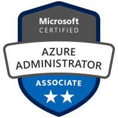
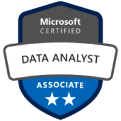
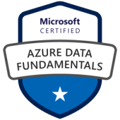
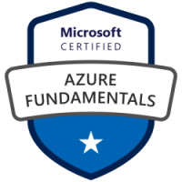
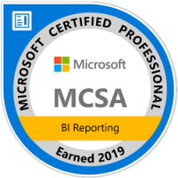

# About

Lance England is a data professional focused on data, analysis, integration, and automation using SQL Server, Power BI, DAX, SQL Server Analysis Server, BizTalk, PowerShell, C#, and more. He has industry experience in health care, manufacturing, property rental, and non-profit sectors. He graduated from Georgia State University with a major in Computer Information Systems.

## Presentations

Slides and demos from past presentations.

**Fundamentals of DAX**  
SQL Saturday #919 Atlanta, GA - 2019 October 19  
[Slides/Demos](/assets/presentations/dax_fundamentals_sqlsat919.zip)

**Fundamentals of MDX**  
SQL Saturday #328 Birmingham AL - 2014 August 08  
[Slides/Demos](/assets/presentations/fundamentals_of_mdx_sqlsat328.zip)

**Fundamentals of MDX**  
Atlanta MDF - 2014 July 14  
[Slides/Demos](/assets/presentations/fundamentals_of_mdx_atlantamdf.zip)

**Fundamentals of MDX**  
SQL Saturday #285 Atlanta GA - 2014 May 04  
[Slides/Demos](/assets/presentations/fundamentals_of_mdx_sqlsat285.zip)

**MDX: Fundamentals**  
Atlanta Microsoft Business Intelligence User Group - 2014 February 24  
[Slides/Demos](/assets/presentations/mdx_fundamentals_atlantabi.zip)

**Data Management and Indexing Options for SQL Server Data Warehouses**  
Atlanta MDF - 2013 August 12  
[Slides/Demos](/assets/presentations/data_mgmt_atlantamdf.zip)

 All slides and demos are licensed under a <a rel="license" href="http://creativecommons.org/licenses/by-nc-sa/4.0/">Creative Commons Attribution-NonCommercial-ShareAlike 4.0 International License</a>.

## Certifications

 

 

 

 

